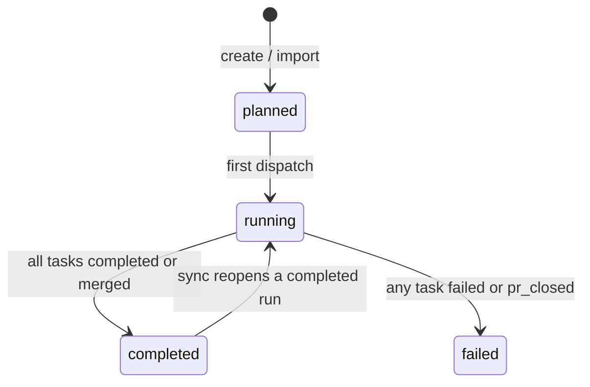
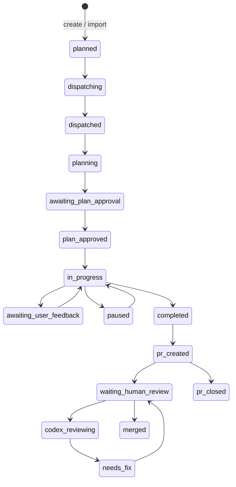

# jules-agent

`jules-agent` is a CLI for handing off work to Jules with a little more structure around it.
It turns a task into a plan, sends the work to Jules, and helps you keep moving through feedback, review, and merge.

- 日本語版: [README_ja.md](README_ja.md)

## What it does

`jules-agent` helps with the full loop around a coding task:

- turn a single request into a workable plan
- surface clarification questions before the work starts
- send the task to Jules
- collect feedback and move the task forward
- review the result and merge the pull request when it is ready

It is useful whether you want a light planning pass or a more hands-on loop around implementation and review.

## Requirements

- Python 3.12 or newer
- `git` available on `PATH`
- `JULES_API_KEY` set in the environment, or `api_key` configured in TOML
- `GITHUB_TOKEN` set when you want review, merge, or PR status syncing

Repository assumptions:

- you are inside a Git repository
- the repository has a GitHub remote
- Jules is already set up for the GitHub account as an app and has access to the repository

`jules-agent` talks to the Jules API directly, so a local `jules` CLI binary is not required.

If you do not run the command inside a git repository, pass `--repo owner/name`.

## Install

From PyPI:

```bash
pipx install jules-agent
```

```bash
uv tool install jules-agent
```

```bash
pip install jules-agent
```

From a local checkout:

```bash
pip install -e .
```

After installing, the `jules-agent` command is available on your `PATH`.

## Usage

```bash
jules-agent [flags] <command> [args]
```

The common flow is:

1. Create a task with `run`.
2. Check progress with `status` and `sync`.
3. Approve, give feedback, or send a direct message if needed.
4. Review the pull request.
5. Merge when it is ready.

### Subcommands

- `run [flags] <task>`: Analyze a new task with the configured planning tool and dispatch it to Jules.
  - In interactive mode, it may first ask clarification questions before generating a plan.
  - `--no-confirm`: Skip the confirmation loop and dispatch immediately.
  - `--auto-plan-approval`: Automatically approve the task plan (forces `requirePlanApproval=false`).
  - `--automation-mode <mode>`: Specify the automation mode for the Jules session.
    - `AUTO_CREATE_PR` (default): Whenever a final code patch is generated in the session, automatically create a branch and a pull request for it.
    - `AUTOMATION_MODE_UNSPECIFIED`: The automation mode is unspecified. Default to no automation.
- `import <session_id>`: Import an existing Jules session into the local state.
  - Supports both bare IDs (e.g., `12345`) and full session names (e.g., `sessions/12345`).
- `status`: Show the current local state, including runs and tasks. By default, it only shows runs with `planned` or `running` status.
  - `-a`, `--all`: Show all runs, including completed, failed, and cancelled.
  - `--show-activities`: Show detailed session activities for each task.
- `sync`: Synchronize the local state with the Jules API and GitHub (to update PR status).
- `advance [flags]`: Automatically or interactively advance work across the next active task. For `sequential_subtasks`, a successful merge also dispatches the next `planned` task in the same run.
- `cron [flags]`: Non-interactive background execution. This is a purely automated version of `advance` that never asks for input, and it also dispatches the next `planned` task after a successful sequential merge.
- `approve [task_id]`: Manually approve the proposed plan for a specific task. If `task_id` is omitted, it shows a list of tasks awaiting plan approval.
- `send [task_id] message`: Send a manual message to a task's Jules session. If `task_id` is omitted, it shows a list of active tasks. If your message contains spaces and you omit `task_id`, the message must be quoted (e.g., `jules-agent send "hello world"`).
- `feedback [task_id]`: Enter an interactive feedback loop to refine a task's plan or reply. If `task_id` is omitted, it shows a list of eligible tasks.
- `review [task_id]`: Run a review for a task with an open pull request. If `task_id` is omitted, it shows a list of tasks with open pull requests.
- `merge [task_id]`: Manually merge the pull request associated with a task. If `task_id` is omitted, it first performs a full state synchronization and then shows a list of tasks with open pull requests.
- `next [run_id]`: Dispatch the next task in a sequential run. If `run_id` is omitted, it shows a list of active sequential runs with planned tasks.
  - `--automation-mode <mode>`: Specify the automation mode for the Jules session (e.g., `AUTO_CREATE_PR` or `AUTOMATION_MODE_UNSPECIFIED`).
- `delete run [run_id]`: Delete a run and its tasks from the local state.
- `delete task [task_id]`: Delete a specific task from the local state. If the run becomes empty, it is also removed.
- `rm`: An alias for `delete`.
  - Omitting `run_id` or `task_id` triggers an interactive selection prompt.
  - `--dry-run`: Show what would be deleted without making changes.
  - `--yes`, `-y`: Skip confirmation prompts and proceed immediately.

### Status Transitions

`run.status` is mostly derived from task states during `sync` and `import`.





### Global Flags

- `--version`: Show the package version.
- `--debug`: Enable debug output.
- `--repo owner/name`: Override the target repository.
- `--tool-bin /path/to/tool`: Path to the backend tool executable.
- `--tool <name>`: Backend tool to use.
- `--gemini-skip-trust`: Pass `--skip-trust` to the Gemini CLI adapter.
- `--plan-tool <name>`: Tool override for the planning phase.
- `--approve-tool <name>`: Tool override for the approval phase.
- `--feedback-tool <name>`: Tool override for the feedback phase.
- `--review-tool <name>`: Tool override for the review phase.
- `--config /path/to/config.toml`: Specify a custom configuration file.

Supported backend tools are `codex`, `claude`, `gemini`, `opencode`, `copilot`, and `cline`.
Use `--tool` to set one default backend, or override individual phases with `--plan-tool`, `--approve-tool`, `--feedback-tool`, and `--review-tool`.

The `--tool-bin` flag and `tool_bin` config field let you point at a specific backend binary.

### Automation Flags (for `advance` and `cron`)

- `--auto-plan-approval`: Automatically approve plans when recommended by the planning tool.
- `--auto-feedback`: Automatically send suggested feedback messages.
- `--auto-merge`: Automatically merge pull requests when they are ready.
- `--auto`: Enable both plan approval and feedback (does NOT include merge).
- `--json`: Emit the result as a single JSON object.

### Examples

```bash
# 1. Create a task
jules-agent run "Split the parser from the dispatcher"

# 2. Check progress and capture the run/task IDs
jules-agent status

# 3. Refresh local state from Jules and GitHub
jules-agent sync

# 4. If the task is waiting for a plan decision, approve it
jules-agent approve RUN_ID:TASK_ID

#    Or, if the plan needs changes, give feedback instead
jules-agent feedback RUN_ID:TASK_ID

# 5. Review the pull request once Jules opens one
jules-agent review RUN_ID:TASK_ID

# 6. Merge the pull request when it is ready
jules-agent merge RUN_ID:TASK_ID
```

For a sequential run, you can keep going with:

```bash
# Dispatch the next planned task in the run
jules-agent next RUN_ID

# Or let the tool advance work and merge automatically
jules-agent advance --auto
```

## Configuration

`jules-agent` can be configured using TOML files. It searches for configuration in the following locations (in order of increasing priority):

1. `~/.jules-agent.toml`
2. `~/.config/jules-agent/config.toml`
3. `./.jules-agent.toml`
4. `./jules-agent.toml`
5. A custom file specified via `--config`

Settings in the configuration file have lower priority than environment variables and command-line flags. For automation flags, the priority is:
1. Individual CLI flag (e.g., `--auto-merge`, `--automation-mode`)
2. The `--auto` flag (sets approval and feedback to true)
3. Configuration file settings
4. Default values (auto_plan_approval=true, others=false, automation_mode="AUTO_CREATE_PR")

### GitHub Token

`jules-agent` reads `GITHUB_TOKEN` from the environment, or `github_token` from the TOML configuration file.

Need permissions:
- pull-requests: write
- issues: write
- contents: write

### Supported Settings

```toml
api_key = "your-jules-api-key"
repo = "owner/repo"
github_token = "ghp_your-github-token"
tool_bin = "path/to/tool"
tool = "codex"
debug = false
gemini_skip_trust = false
plan_tool = "claude"
approve_tool = "gemini"
feedback_tool = "opencode"
review_tool = "copilot"
base_url = "https://jules.googleapis.com/v1alpha"
merge_method = "rebase"
merge_delete_branch = true
merge_pull = true
automation_mode = "AUTO_CREATE_PR"
```

Example:

```bash
jules-agent --repo example-org/example-repo "Split the parser from the dispatcher"
```

## Output

The CLI prints one line per dispatch result:

```text
Jules dispatch result(s): 2
1. [success] [123456] Update the parser
2. [success] [123457] Add tests
```

If the planning tool fails, the command exits non-zero and includes the command plus captured stdout and stderr.
If a Jules dispatch fails, the CLI prints `failure` for that subtask, shows the captured command output, and exits non-zero after the first failure.
If confirmation mode is enabled and stdin is not interactive, the CLI exits with an error and tells you to use `--no-confirm`.
If a command is run without a `task_id` and stdin is not interactive, the CLI exits with an error.

## How It Works

The planning step expects JSON shaped like this:

```json
{
  "strategy": "single_session",
  "tasks": [
    { "title": "First task" }
  ]
}
```

`strategy` can be `single_session` or `sequential_subtasks`. Each task can also be a plain string. The dispatcher turns the title and any available details into the prompt passed to Jules.

## Development

Run the tests with:

```bash
python3 -m pytest
```

The tests cover JSON parsing, subtask normalization, session ID extraction, and the end-to-end pipeline error path.
