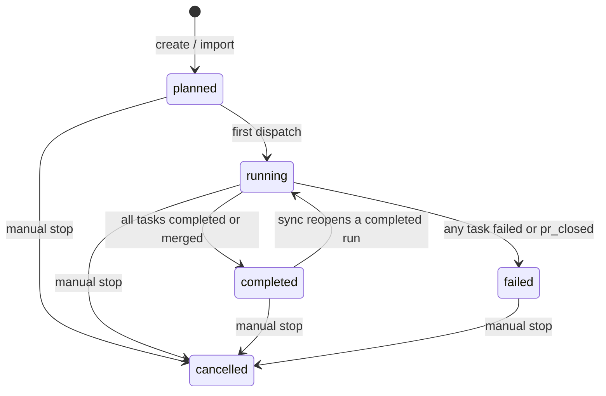
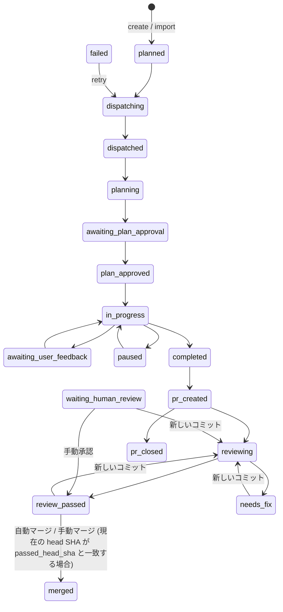

# jules-agent

`jules-agent` は、Jules への作業引き継ぎを少しだけ構造化して行うための CLI です。
タスクを計画にまとめて Jules に送信し、その後のフィードバック、レビュー、マージまでの流れを支援します。

- English version: [README.md](README.md)

## できること

`jules-agent` は、コーディングタスクの一連の流れをまとめて扱えます。

- 1つの依頼を実行可能な計画にする
- 作業開始前に確認質問を出す
- タスクを Jules に送る
- フィードバックを集めて作業を前に進める
- 結果をレビューし、準備ができたら pull request をマージする

軽い計画だけ欲しい場合にも、実装からレビューまで手を動かしたい場合にも使えます。

## 必要条件

- Python 3.12 以上
- `git` が `PATH` 上で利用可能
- 環境変数 `JULES_API_KEY` を設定済み、または TOML で `api_key` を設定済み
- レビュー、マージ、PR 状態の同期を使う場合は `GITHUB_TOKEN` を設定

前提として、以下を想定しています。

- Git リポジトリの中で実行している
- リポジトリに GitHub の remote がある
- Jules が GitHub アカウント向けのアプリとして設定されており、対象リポジトリにアクセスできる

`jules-agent` は Jules API に直接アクセスするため、ローカルに `jules` CLI バイナリは不要です。

Git リポジトリの外で実行する場合は、`--repo owner/name` を指定してください。

## インストール

PyPI から:

```bash
pipx install jules-agent
```

```bash
uv tool install jules-agent
```

```bash
pip install jules-agent
```

ローカル checkout から:

```bash
pip install -e .
```

インストール後は、`jules-agent` コマンドが `PATH` 上で使えるようになります。

## 使い方

```bash
jules-agent [flags] <command> [args]
```

基本的な流れは次のとおりです。

1. `run` でタスクを作成する
2. `status` と `sync` で進捗を確認する
3. 必要に応じて approve、feedback、直接メッセージ送信を行う
4. pull request をレビューする
5. 準備ができたらマージする

### サブコマンド

- `run [flags] <task>`: 設定された計画用ツールで新しいタスクを解析し、Jules に送る。
  - 対話モードでは、計画生成の前に確認質問が出ることがある
  - `--no-confirm`: 確認ループを省略して、そのまま送信する
  - `--auto-plan-approval`: タスク計画を自動承認する（`requirePlanApproval=false` を強制）
  - `--automation-mode <mode>`: Jules セッションの automation mode を指定する
    - `AUTO_CREATE_PR`（既定）: セッション内で最終コードパッチが生成されるたびに、自動で branch と pull request を作成する
    - `AUTOMATION_MODE_UNSPECIFIED`: automation mode を未指定にする。自動化は行わない既定動作になる
- `import <session_id>`: 既存の Jules セッションをローカル state に取り込む
  - `12345` のような bare ID と、`sessions/12345` のような完全な session name の両方に対応
- `status`: 現在のローカル state を表示する。run と task を含む
  - 既定では `planned` または `running` の run だけを表示
  - `-a`, `--all`: completed、failed、cancelled を含むすべての run を表示
  - `--show-activities`: 各 task の session activity を詳細表示する
- `sync`: ローカル state を Jules API と GitHub に同期する（PR 状態の更新を含む）
- `advance [flags]`: 次の active task に対して、作業を自動または対話的に進める
  - `sequential_subtasks` では、マージ成功後に同じ run の次の `planned` task も送信する
- `cron [flags]`: 非対話のバックグラウンド実行。`advance` の完全自動版で、入力は一切求めない
  - `sequential_subtasks` のマージ成功後に、次の `planned` task も送信する
- `approve [task_id]`: 特定 task の提案された計画を手動承認する
  - `task_id` を省略すると、plan 承認待ちの task 一覧を表示する
- `send [task_id] message`: task の Jules セッションに手動メッセージを送る
  - `task_id` を省略すると、アクティブな task 一覧を表示する
  - `task_id` を省略してメッセージに空白がある場合は、メッセージ全体を引用符で囲む必要がある（例: `jules-agent send "hello world"`）
- `feedback [task_id]`: task の計画や返信を詰めるための対話的なフィードバックループを開始する
  - `task_id` を省略すると、対象となる task 一覧を表示する
- `review [task_id]`: オープンな pull request を持つ task のレビューを実行する
  - `task_id` を省略すると、オープンな pull request を持つ task 一覧を表示する
- `review-pass [task_id]`: 特定の task を、現在の head SHA に対して `review_passed` 状態としてマークする。手動レビューをバイパスしたり、自動レビュー結果を上書きしたりする場合に使用する
- `merge [task_id]`: task に紐づく pull request を手動でマージする
  - `task_id` を省略すると、オープンな pull request を持つ task 一覧を表示する
- `next [run_id]`: sequential run の次の task を送信する
  - `run_id` を省略すると、`planned` task を持つ active な sequential run 一覧を表示する
  - `--automation-mode <mode>`: Jules セッションの automation mode を指定する（例: `AUTO_CREATE_PR` または `AUTOMATION_MODE_UNSPECIFIED`）
- `retry [task_id]`: 失敗したタスクを新しい Jules セッションで再試行する。
  - `task_id` を省略すると、`failed` 状態のタスク一覧を表示する。
  - `advance` とは異なり、既存のセッションを再開せず、同じタスクに対して新しいセッションを開始する。
  - `--automation-mode <mode>`: 新しい Jules セッションの automation mode を指定する。
- `delete run [run_id]`: 指定した run とその配下の task をローカル state から削除する
- `delete task [task_id]`: 指定した task をローカル state から削除する。run が空になった場合は run も削除される
- `rm`: `delete` の別名
  - `run_id` や `task_id` を省略した場合は、候補の一覧から選択する対話的プロンプトが表示されます。
  - `--dry-run`: 実際に削除は行わず、削除対象の確認だけを行います。
  - `--yes`, `-y`: 確認プロンプトをスキップして即座に削除を実行します。

### 状態遷移

`run.status` は、`sync` と `import` のときに task の状態から主に再計算されます。





### グローバルフラグ

- `--version`: パッケージのバージョンを表示する
- `--debug`: デバッグ出力を有効にする
- `--repo owner/name`: 対象リポジトリを上書きする
- `--tool-bin /path/to/tool`: backend tool の実行ファイルへのパス
- `--tool <name>`: 使用する backend tool
- `--gemini-skip-trust`: Gemini CLI adapter に `--skip-trust` を渡す
- `--plan-tool <name>`: 計画フェーズで使う tool を上書きする
- `--approve-tool <name>`: 承認フェーズで使う tool を上書きする
- `--feedback-tool <name>`: フィードバックフェーズで使う tool を上書きする
- `--review-tool <name>`: レビューフェーズで使う tool を上書きする
- `--config /path/to/config.toml`: カスタム設定ファイルを指定する

対応している backend tool は `codex`、`claude`、`gemini`、`opencode`、`copilot`、`cline` です。
`--tool` で既定の backend を指定するか、`--plan-tool`、`--approve-tool`、`--feedback-tool`、`--review-tool` で各フェーズを個別に上書きできます。

`--tool-bin` フラグと `tool_bin` 設定項目で、特定の backend バイナリを指定できます。

### 自動化フラグ（`advance` と `cron` 用）

- `--auto-plan-approval`: 計画用ツールが推奨したときに、計画を自動承認する
- `--auto-feedback`: 提案されたフィードバックメッセージを自動送信する
- `--auto-merge`: 準備ができた pull request を自動マージする。既定では task が `review_passed` 状態であり、かつ記録された `passed_head_sha` が現在の PR head SHA と一致している必要がある
- `--auto`: 計画承認とフィードバックの両方を有効にする（マージは含まない）
- `--skip-review`: レビューゲートをスキップする。有効な場合、`pr_created` や `waiting_human_review` のタスクも、レビュー状態や SHA の一致に関わらずマージ対象になる
- `--json`: 結果を単一の JSON オブジェクトとして出力する

### 例

```bash
# 1. タスクを作成する
jules-agent run "Split the parser from the dispatcher"

# 2. 進捗を確認して run/task ID を控える
jules-agent status

# 3. Jules と GitHub からローカル state を更新する
jules-agent sync

# 4. タスクが plan 判定待ちなら承認する
jules-agent approve RUN_ID:TASK_ID

#    あるいは、計画の修正が必要ならフィードバックを送る
jules-agent feedback RUN_ID:TASK_ID

# 5. Jules が pull request を開いたらレビューする
jules-agent review RUN_ID:TASK_ID

# 6. 準備ができたら pull request をマージする
jules-agent merge RUN_ID:TASK_ID
```

sequential run では、次のように続けられます。

```bash
# run 内の次の planned task を送信する
jules-agent next RUN_ID

# あるいは、ツールに作業とマージを自動で進めさせる
jules-agent advance --auto
```

## 設定

`jules-agent` は TOML ファイルで設定できます。設定ファイルは次の場所を、優先度の低い順に探します。

1. `~/.jules-agent.toml`
2. `~/.config/jules-agent/config.toml`
3. `./.jules-agent.toml`
4. `./jules-agent.toml`
5. `--config` で指定した任意のファイル

設定ファイルの値よりも、環境変数とコマンドラインフラグが優先されます。自動化フラグの優先順位は次のとおりです。

1. 個別の CLI フラグ（例: `--auto-merge`, `--automation-mode`）
2. `--auto` フラグ（承認とフィードバックを true にする）
3. 設定ファイル
4. 既定値（`auto_plan_approval=true`、その他は `false`、`automation_mode="AUTO_CREATE_PR"`）

### GitHub Token

`jules-agent` は環境変数の `GITHUB_TOKEN`、または TOML 設定ファイルの `github_token` を読みます。

必要な権限:

- pull-requests: write
- issues: write
- contents: write

### 対応設定

```toml
api_key = "your-jules-api-key"
repo = "owner/repo"
github_token = "ghp_your-github-token"
tool_bin = "path/to/tool"
tool = "codex"
debug = false
gemini_skip_trust = false
plan_tool = "claude"
approve_tool = "gemini"
feedback_tool = "opencode"
review_tool = "copilot"
base_url = "https://jules.googleapis.com/v1alpha"
merge_method = "rebase"
automation_mode = "AUTO_CREATE_PR"
skip_review = false
```

例:

```bash
jules-agent --repo example-org/example-repo "Split the parser from the dispatcher"
```

## 出力

CLI は dispatch 結果を 1 行ずつ表示します。

```text
Jules dispatch result(s): 2
1. [success] [123456] Update the parser
2. [success] [123457] Add tests
```

計画ツールが失敗した場合、コマンドは非 0 で終了し、コマンド本体と取得済みの stdout / stderr を含めて表示します。
Jules の dispatch が失敗した場合、CLI はその subtask に `failure` を表示し、取得済みのコマンド出力を出して、最初の失敗で非 0 終了します。
確認モードが有効で stdin が非対話の場合、CLI はエラーで終了し、`--no-confirm` を使うよう案内します。
`task_id` なしでコマンドが実行され、stdin が非対話の場合も、CLI はエラーで終了します。

## 動作のしくみ

計画ステップは、次のような JSON を想定しています。

```json
{
  "strategy": "single_session",
  "tasks": [
    { "title": "First task" }
  ]
}
```

`strategy` は `single_session` または `sequential_subtasks` を指定できます。各 task は単純な文字列でも構いません。dispatcher は title と、取得できる詳細情報をまとめて Jules に渡す prompt に変換します。

## 開発

テストを実行するには:

```bash
python3 -m pytest
```

テストでは、JSON 解析、subtask の正規化、session ID の抽出、pipeline の end-to-end エラー経路を確認しています。
